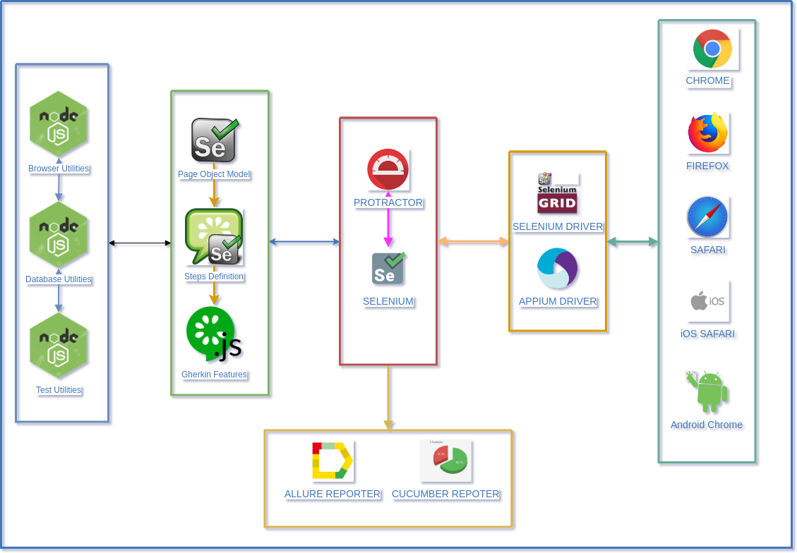
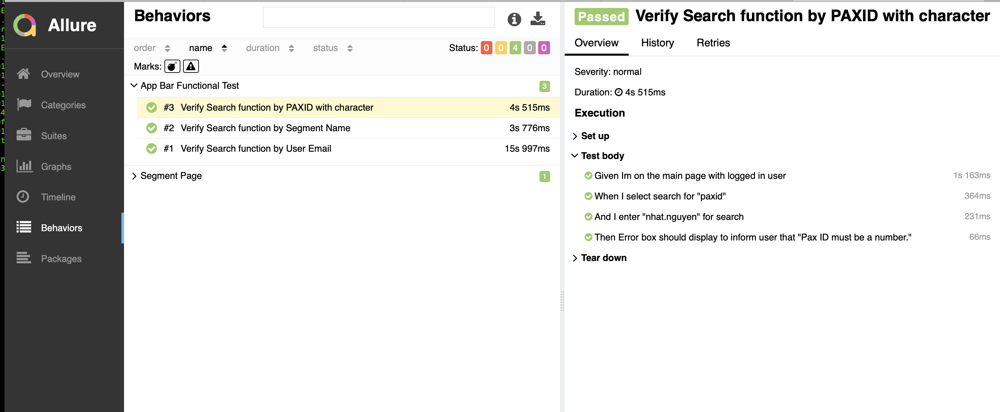
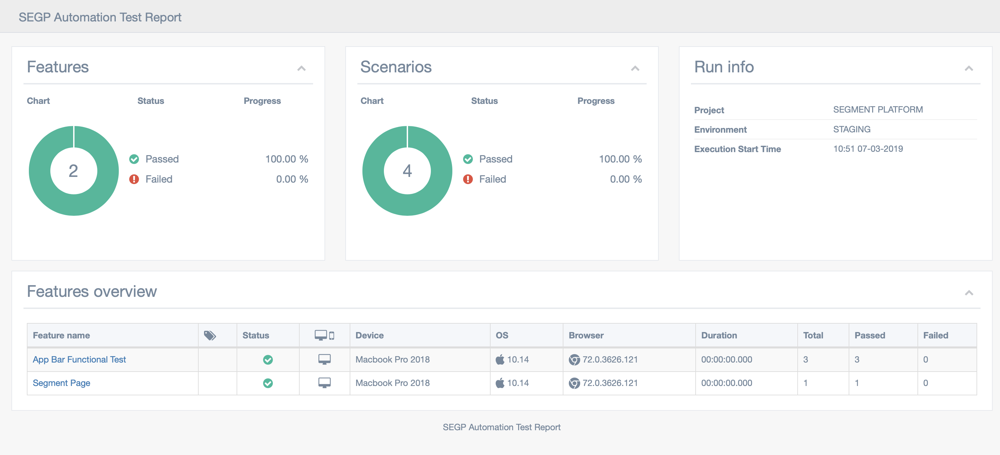

# Segment  Automated Testing Platform

**Descriptions**
* Automated testing framework using
    * Protractor
    * Cucumber
    * Allure Report
    * Multiple Cucumber HTML Report
    
**Benefit**
* Coverage test cases for business flow which unit tests could not cover.
* Ensure business flow will not be break when we refactor codes, update new functions.
* Reduce unit tests efforts as coverage percent would include both unit tests + e2e test.
 
**Features**
* Stable scripts
* Lots of `waitfor…` functions to avoid `sleep`
* Helper to open and close windows, tabs, popups, etc
* API testing steps pre-defined
* Most of the actions have a retry logic inside, which retries the action 3 (or configurable number of) times before an error is thrown
* Ready for tests written with [`async` / `await`](https://github.com/angular/protractor/blob/master/docs/async-await.md) (every function returns a promise)
* Beatiful reporting with `CI integrate ready` with Allure2 / Protractor Multiple Cucumber Html Reporter 
* Ready for cross browser testing, support almost popular browsers
* Ready for visual regression testing
* Container based. No need to install any dependencies to run

## Table of Contents
* [Installation](#installation)
* [Architect](#architect)
* [Structure](#structure)
* [Sample Report](#report)
* [Usage](#usage)
* [Integration](#integrate)
* [TODO](#todo)


<a id="installation"></a>
## Installation
1. ### MacOs / Linux
    * Clone this project
    * [Install docker && docker-compose](https://docs.docker.com/compose/install/)
    * Execute these commands: (In case you are using Linux/MacOS)
        ```bash
        chmod u+x ./run.sh
        ./run.sh
        ```
        * Please **allow** default browser to be able to open html file for automatically open result 
2. ### Window
    * Clone this project
    * [Install docker && docker-compose](https://docs.docker.com/compose/install/)
    * Execute these commands
        ```
        rm -rf node_modules/
        cp ./example.env.bak .env
        docker-compose build
        docker-compose up -d --force-recreate
        docker-compose run test /test/execute.sh
        ```

<a id="architect"></a>
## Framework Architect:

<a id="structure"></a>
## Framework Structure:

```
├── framework_config             | Contains all framework configurations 
│   └── cucumber_support         | All cucumber execution configurations : hooks, report ...
├── helpers                      | All utility libraries 
│   ├── browser_utilities        | Helper library for interact with browser
│   ├── dockers                  | Docker image to run test
│   ├── slack                    | Slack bot to send message when test failed to channel
│   └── visual_utilities         | Helper to verify web page screenshot
├── reports                      | Report out here
│   └── html
├── resources                    | Project's static resource 
├── test
│   ├── features                 | Feature folders to store Gherkin test scenarios
│   ├── pages                    | Store Page Object Models files
│   └── steps                    | Steps folder to store all cucumber steps generated for gherkin features
└── visual-baseline              | Contains Web page screenshot baseline

```


<a id="usage"></a>
## Using Framework
* Create page object model in `./test/pages/` folder
* Create new .feature file in `./test/features/` folder
* Generate steps in `./test/steps/`

#### Usage library:
* Browser Library [here](resources/BrowserLibs.md)
* API Library [here](resources/APILibs.md)


Tests are provide in several modes : 
* experiment: Run only scenarios have tagged : @run
* smoke: Run only scenarios have tagged : @smoke
* regression: Run all scenarios which has no @manual/@ignore tag
* ui: Run only scenarios have tagged : @ui

<a id="report"></a>
## [Smoke Test Daily Report](https://wiki.grab.com/display/SPlatform/Smoke+Testing)
## Sample Report
### Allure

### HTML


<a id="integrate"></a>
## Integration
* Copy whole project into e2e ( or tests /or any )
* Add one stage in CI stage with execute test after build. We can consider execute this e2e stage parallel with code scanning - unit testing.

  
___
<a id="todo"></a>
## TODO


